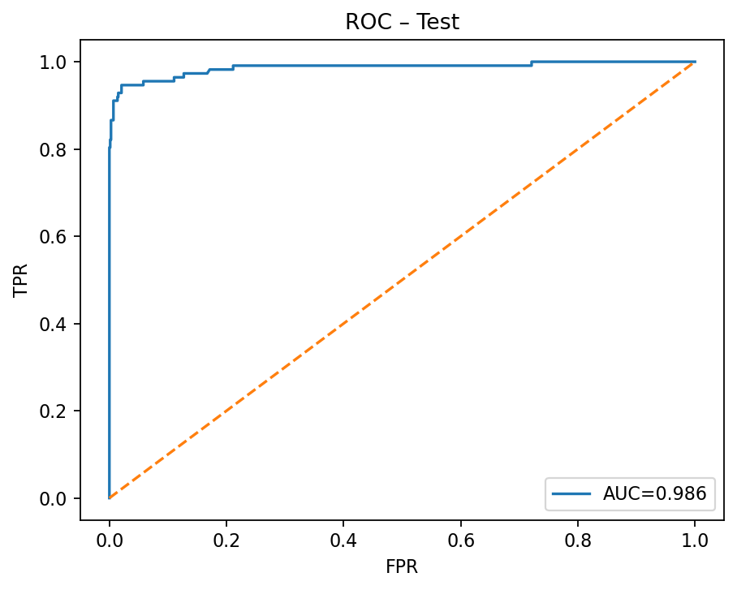
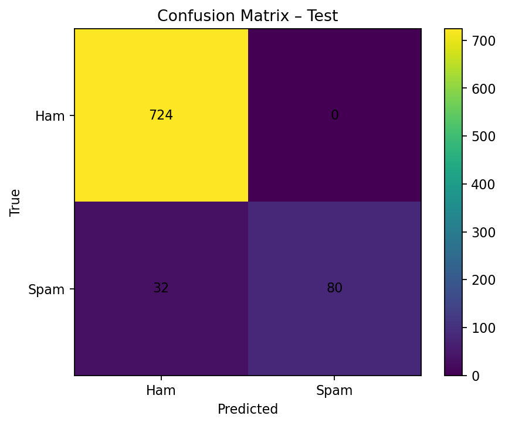

# 💬 SMS Spam Classifier (NLP – Easy Project)

A clean, reproducible **Spam vs Ham** SMS classifier that demonstrates end-to-end NLP workflow — from data cleaning and EDA to modeling, evaluation, and interpretability.

---

## 🧠 Overview
**Task:** Binary text classification (_spam_ vs _ham_) on the classic **SMS Spam Collection** dataset (5,574 messages).  
**Approach:** `TF-IDF` features (unigrams + bigrams) → `Logistic Regression` baseline.  
**Why it matters:** Provides a strong, interpretable baseline — ideal for discussing **precision vs recall**, **threshold tuning**, and **deployment considerations**.

---

## 📊 Model Performance

| Split | Accuracy | Spam Precision | Spam Recall | F1 (Spam) | ROC-AUC |
|:------|----------:|---------------:|-------------:|----------:|--------:|
| **Validation** | 0.968 | 1.000 | 0.759 | 0.863 | **0.996** |
| **Test** | 0.962 | 1.000 | 0.714 | 0.833 | **0.986** |

🧩 **Interpretation:**  
The model achieves **very high precision** (few false positives) but **lower recall** (some missed spam). Use threshold tuning (see Notebook `03_threshold_tuning.ipynb`) to optimize this trade-off.

---

## 📈 Key Visualizations

<table>
<tr>
<th>ROC Curve</th>
<th>Confusion Matrix</th>
</tr>
<tr>
<td></td>
<td></td>
</tr>
</table>

---

## 🧰 Project Structure

```
sms-spam-classifier/
├── data/
│   ├── raw/SMSSpamCollection        # raw dataset (TSV: label \t text)
│   └── processed/                   # optional train/val/test splits
├── models/
│   └── latest/model.joblib          # trained TF-IDF + LR pipeline
├── notebooks/
│   ├── 01_eda.ipynb
│   ├── 02_eval_plots.ipynb
│   └── 03_threshold_tuning.ipynb
├── reports/
│   ├── figures/                     # exported plots
│   ├── top_features_ham.txt
│   └── top_features_spam.txt
├── src/
│   ├── train.py                     # train + evaluate + save model
│   ├── infer.py                     # CLI scoring
│   └── top_ngrams.py                # inspect top weighted n-grams
├── environment.yml                  # conda environment (recommended)
├── requirements.txt                 # pip alternative
└── README.md
```

---

## ⚡ Quickstart
```bash
# 0️⃣ Create & activate environment
conda env create -f environment.yml
conda activate nlp-easy
# or
python -m venv .venv && source .venv/bin/activate && pip install -r requirements.txt

# 1️⃣ Place data (TSV format, no header)
#    Path: data/raw/SMSSpamCollection

# 2️⃣ Train & evaluate
python src/train.py --data data/raw/SMSSpamCollection

# 3️⃣ Inspect top features
python src/top_ngrams.py --model_dir models/latest --k 25

# 4️⃣ Score new messages
python src/infer.py --model_dir models/latest --text "Free entry to win £1000!"
printf '%s\n%s\n' 'win cash now!!!' 'Hey, are we meeting at 5?' | python src/infer.py --model_dir models/latest
```

## 📘 Interactive Notebooks (HTML Exports)

Explore the full workflow directly through rendered HTML notebooks (hosted in this repo):

- [**01_eda.html**](notebooks/exports/01_eda.html) – Exploratory Data Analysis  
- [**02_eval_plots.html**](notebooks/exports/02_eval_plots.html) – Model Evaluation (ROC, Confusion Matrix)  
- [**03_threshold_tuning.html**](notebooks/exports/03_threshold_tuning.html) – Threshold Tuning & Precision-Recall Analysis
 
---

## 👤 Author

**Nursultan Azhimuratov**  
🎓 PhD Candidate in Statistics | 💻 Data Scientist  
🔗 [GitHub: @drnursultan](https://github.com/drnursultan)
